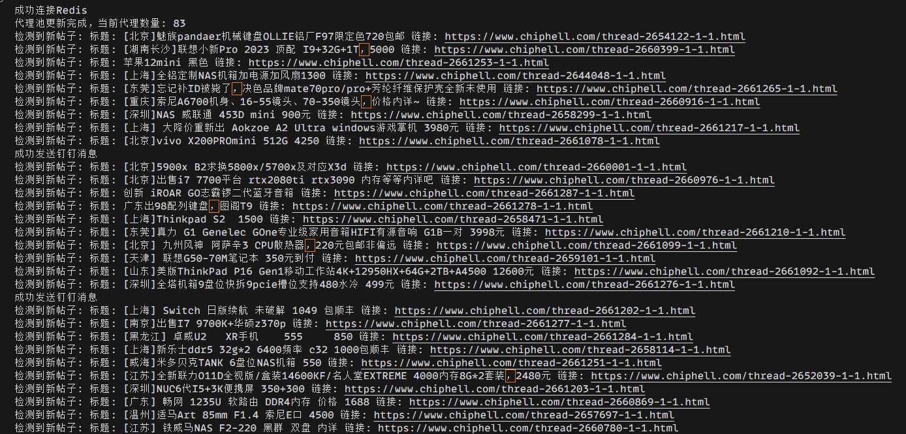
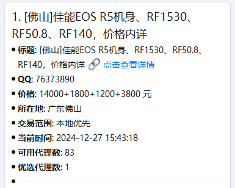
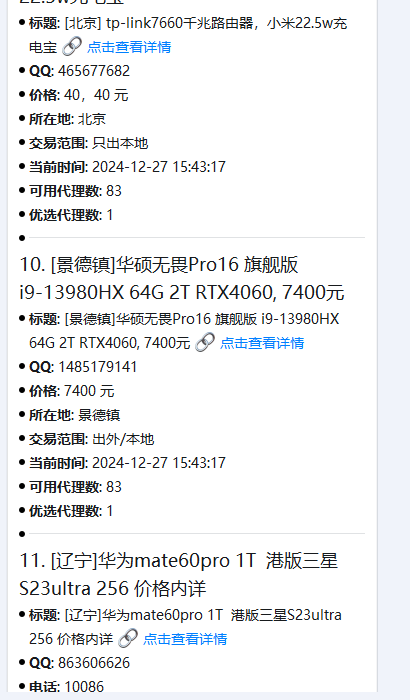

# Chiphell 二手区监控

[](https://github.com/langchou/informer)
[](https://github.com/langchou/informer/blob/main/LICENSE)

一个用于监控 Chiphell 论坛二手交易区的自动化工具。支持关键词匹配、钉钉通知等功能。

## 功能特点

- 🔍 实时监控二手交易区新帖
- 🎯 支持多关键词匹配
- 📱 钉钉机器人通知，支持@指定用户
- 🔄 智能代理池管理
- 🗃️ 本地数据持久化
- 🚫 智能去重和过滤
- 🐳 支持 Docker 部署

## 使用示例

### 运行效果

1. 程序运行日志


2. 钉钉通知效果
- 基础通知


- 详细通知（带商品信息）


通知说明：
- 基础通知：当无法获取详细信息时，仅显示标题和链接
- 详细通知：包含完整的商品信息（价格、地点、联系方式等）
- 支持@指定用户：根据关键词自动@相关用户

## 快速开始

### 使用 Docker Compose（推荐）

1. 创建配置文件

```bash
mkdir -p data
touch data/config.yaml
```

2. 编辑 `data/config.yaml` 配置文件

```yaml
logconfig:
  file: "data/app.log"
  maxSize: 10
  maxBackups: 5
  maxAge: 30
  compress: true
  level: "info"

dingtalk:
  token: "your-token"
  secret: "your-secret"

# 代理池配置（可选）
proxyPoolAPI: ""  # 留空则不使用代理

# Chiphell配置
cookies: "your-cookies"
userKeyWords:
  "158********":  # 手机号用于@通知
    - "iphone"    # 关键词

waitTimeRange:  # 监控间隔（秒）
  min: 2
  max: 5

redis:
  addr: "localhost:6379"
  password: ""
  db: 0
```

3. 启动服务

```bash
docker-compose up -d
```

### 使用二进制文件

1. 下载最新版本

```bash
wget -O informer https://github.com/langchou/informer/releases/latest/download/informer-linux-amd64
chmod +x informer
```

2. 创建并编辑配置文件（同上）

3. 运行程序

```bash
./informer
```

## 配置说明

### 钉钉机器人配置

1. 创建钉钉机器人
   - 进入钉钉群 -> 群设置 -> 智能群助手 -> 添加机器人
   - 选择"自定义"机器人
   - 安全设置选择"加签"，记录下 token 和 secret

2. 配置文件说明
   - `token`: 钉钉机器人的 access_token
   - `secret`: 钉钉机器人的签名密钥
   - `userKeyWords`: 用户关键词配置，key 为手机号（用于@通知）

### 代理池配置（可选）

- `proxyPoolAPI`: 代理池API地址，留空则不使用代理
- 支持 HTTP 和 SOCKS5 代理

#### 代理池返回格式说明

默认支持的代理池API返回格式为逗号分隔的代理地址字符串，例如：
```text
socks5://1.2.3.4:1080,http://5.6.7.8:8080,socks5://9.10.11.12:1080
```

如果您的代理池API返回格式不同（如JSON数组），您可以通过以下方式自定义解析：

1. 实现自定义解析器
```go
// pkg/proxy/parser.go
type ProxyParser interface {
    Parse(content string) ([]string, error)
}

// 示例：JSON数组解析器
type JSONProxyParser struct{}

func (p *JSONProxyParser) Parse(content string) ([]string, error) {
    var proxies []string
    err := json.Unmarshal([]byte(content), &proxies)
    return proxies, err
}
```

2. 注册自定义解析器
```go
proxy.SetProxyParser(&JSONProxyParser{})
```

### 日志配置

- `file`: 日志文件路径
- `maxSize`: 单个日志文件最大尺寸（MB）
- `maxBackups`: 保留的旧日志文件数量
- `maxAge`: 日志文件保留天数
- `compress`: 是否压缩旧日志
- `level`: 日志级别（debug/info/warn/error）

## 开发指南

### 环境要求

- Go 1.20+
- Redis
- Make（可选）

### 本地开发

1. 克隆仓库

```bash
git clone https://github.com/langchou/informer.git
cd informer
```

2. 安装依赖

```bash
go mod tidy
```

3. 编译

```bash
make build
# 或
go build -o informer cmd/informer/main.go
```

### 扩展开发

#### 自定义代理池解析

如果需要支持其他格式的代理池API，可以通过实现 `ProxyParser` 接口来扩展：

1. 在 `pkg/proxy` 目录下创建新的解析器文件（如 `custom_parser.go`）：

```go
package proxy

// 自定义解析器
type CustomProxyParser struct {
    // 可以添加必要的字段
}

// 实现 Parse 方法
func (p *CustomProxyParser) Parse(content string) ([]string, error) {
    // 实现自定义的解析逻辑
    // 返回代理地址列表
    return []string{}, nil
}
```

2. 在程序启动时注册解析器：

```go
func main() {
    // ... 其他初始化代码 ...
    
    // 注册自定义代理解析器
    proxy.SetProxyParser(&CustomProxyParser{})
    
    // ... 继续其他初始化 ...
}
```

支持的代理格式：
- `http://host:port`
- `socks5://host:port`

## 注意事项

1. Cookie 有效期
   - 定期更新 cookies 以确保正常访问
   - cookies 失效会导致监控失败

2. 代理使用
   - 建议在被限制访问时才启用代理
   - 确保代理池稳定可用

3. 系统资源
   - 注意日志文件大小
   - 定期清理数据库

## 免责声明

本项目仅用于学习和研究目的，禁止用于任何非法或未经授权的爬取操作。使用者应遵守目标网站的 `robots.txt` 文件规定以及相关法律法规。开发者对使用本项目所产生的任何后果概不负责。
